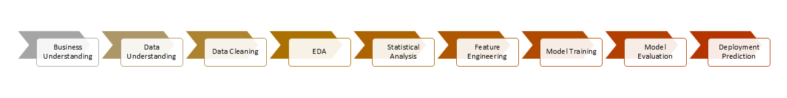

# Intelligent Credit Risk Assessment and Loan Decision Support System Using Machine Learning

## Project Overview

This project presents an end-to-end Machine Learning solution for predicting loan default risk using the LendingClub dataset. The objective is to help financial institutions make data-driven lending decisions by identifying borrowers with a high probability of default.

The project covers the complete machine learning lifecycle, including business understanding, data preprocessing, exploratory data analysis, statistical analysis, feature engineering, predictive modeling, model evaluation, and deployment-oriented prediction.

---

### Highlights

- 396,030 loan applications analyzed
- End-to-end ML pipeline
- Six classification models compared
- XGBoost selected as final model
- Deployment-ready prediction pipeline
- Business-friendly loan recommendation system

---

## Business Problem

Financial institutions face significant challenges in assessing borrower creditworthiness while minimizing loan defaults. Traditional lending decisions often rely on manual evaluation and predefined rules, which may overlook hidden patterns within historical loan data.

This project addresses this challenge by developing an intelligent credit risk assessment system capable of predicting loan default probability and supporting consistent, data-driven loan approval decisions.

---

## Project Objectives

- To develop an end-to-end Machine Learning pipeline for credit risk prediction.
- Analyze borrower and loan characteristics to identify factors associated with loan default.
- Build and compare multiple classification models.
- Select the best-performing model using business-oriented evaluation metrics.
- Generate deployment-ready predictions with business-friendly loan recommendations.

---

## Dataset Information

- **Dataset:** LendingClub Loan Data
- **Records:** 396,030
- **Features:** 27
- **Target Variable:** `loan_status`
  - Fully Paid (0)
  - Charged Off (1)

---

## Project Workflow




---

## Tech Stack

- Python
- Pandas
- NumPy
- Matplotlib
- Seaborn
- Scikit-learn
- XGBoost
- Joblib
- Jupyter Notebook
- Git

---

## Machine Learning Models

The following classification models were developed and evaluated:

- Logistic Regression
- Decision Tree
- Random Forest
- K-Nearest Neighbors (KNN)
- Gaussian Naive Bayes
- XGBoost

After comparative evaluation, **XGBoost** was selected as the final model based on its superior balance of Recall, F1-Score, and ROC-AUC for identifying loan defaults.

---

## Key Features

- End-to-end Machine Learning workflow
- Data Cleaning & Preprocessing
- Exploratory Data Analysis
- Statistical Analysis
- Feature Engineering
- Classification Modeling
- Model Comparison
- Credit Risk Prediction
- Risk Categorization
- Loan Decision Support System
- Deployment-Oriented Prediction Pipeline

---

## Business Insights

- Borrower characteristics significantly influence loan repayment behavior.
- Predictive modeling enables early identification of high-risk loan applicants.
- Default probability provides more actionable insight than binary classification alone.
- Risk categorization simplifies decision-making for lending teams by translating model outputs into business actions.

---

## Business Recommendations

- Use predicted default probabilities to support lending decisions.
- Route medium-risk applicants for manual credit review rather than automatic rejection.
- Continuously retrain the model with recent loan data to maintain predictive performance.
- Integrate the model into lending workflows to improve consistency and reduce credit risk.

---

## Deployment Workflow

The final notebook demonstrates a deployment-oriented prediction pipeline by:

- Loading the trained XGBoost model
- Predicting loan default probability for new loan applications
- Assigning borrower risk categories
- Generating loan approval recommendations
- Exporting prediction results for business use

---

## Repository Structure

```
Loan-Credit-Risk-Assessment-ML/

│
├── data/
├── cleaned/
├── ml/
├── notebooks/
├── outputs/
├── README.md
└── requirements.txt
```

---

## Skills Demonstrated

- Data Analysis
- Data Preprocessing
- Feature Engineering
- Exploratory Data Analysis (EDA)
- Statistical Analysis
- Machine Learning
- Predictive Modeling
- Credit Risk Analytics
- Model Evaluation
- Business Problem Solving
- Decision Support Systems

---

## Future Enhancements

- Hyperparameter Optimization
- Cross Validation
- Explainable AI (SHAP/LIME)
- MLflow Experiment Tracking
- Streamlit-based Web Application
- Cloud Deployment (AWS/Azure)
- Model Monitoring & Retraining

---

## Author

**Purva Dewangan**

MBA (Data Science & Business Analytics) | Data Analyst | AI & Machine Learning Enthusiast
